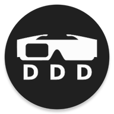
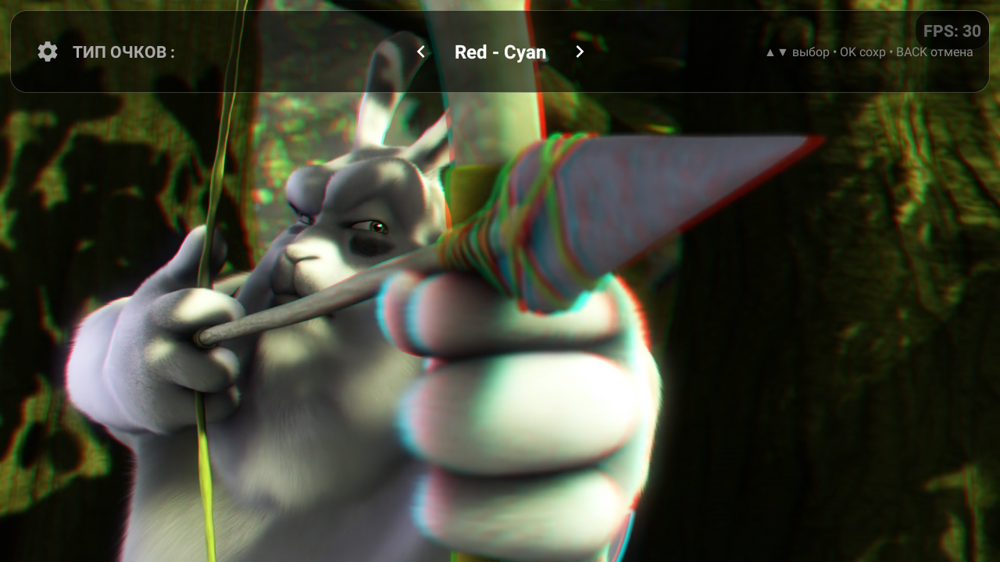
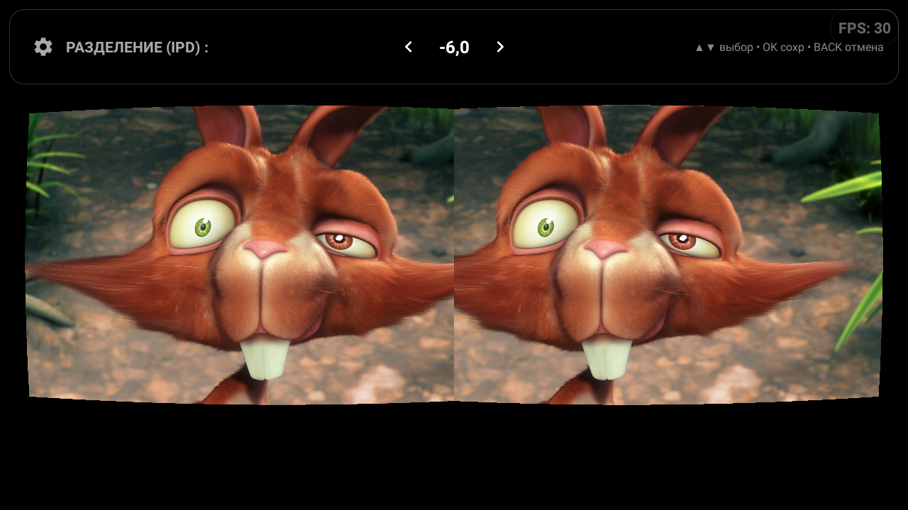
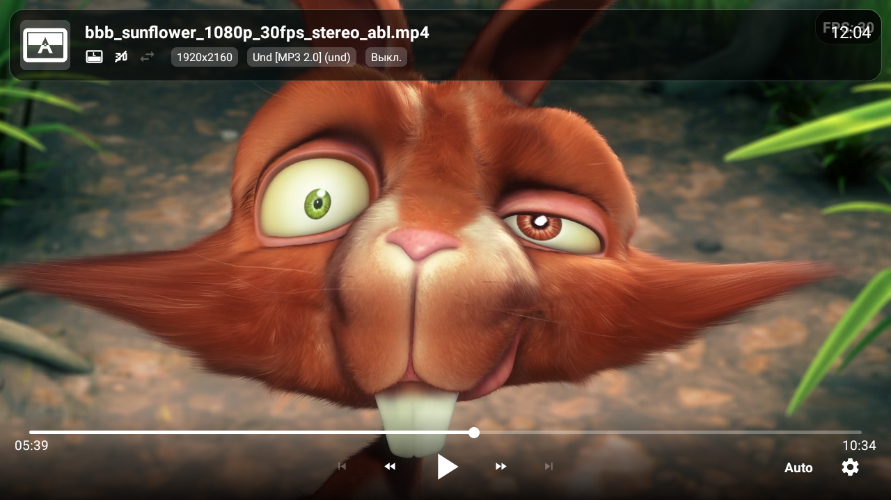

<div align="center">
  
  <h1>DDD Video Player</h1>

  <p>
    <a href="LICENSE">
      
    </a>
    <a href="README_RU.md">
      
    </a>
  </p>

  <p>
    <b>Advanced 3D & HDR Video Player for Android TV and Mobile</b>
    <br>
    <i>Supports Android 6.0 (API 23) and above.</i>
  </p>
</div>

---

**DDD Video Player** is an advanced video player for Android (TV and Mobile) that allows you to watch not only standard 2D videos but also stereoscopic video pairs, creating an immersive 3D effect.

To experience the 3D effect, you will need **anaglyph glasses** (e.g., Red-Cyan) or **Cardboard VR-compatible equipment**.

### Key Features

*   **Stereo Formats Support**:
    *   Side-by-Side (SBS)
    *   Top-Bottom (Over-Under)
    *   Interlaced
    *   3D(z) Tile Format (720p in 1080p)
*   **Output Modes**:
    *   **Anaglyph**: High-quality Dubois algorithm with customizable color matrices (Red-Cyan, Green-Magenta, Yellow-Blue).
    *   **VR / Cardboard**: Lens distortion correction for VR headsets.
    *   **Mono**: Watch 3D content in 2D (Left or Right eye only).
*   **HDR Support**: Direct rendering via SurfaceView for native HDR playback on supported displays (when in 2D mode).
*   **Audio Passthrough**: Supports AC3/DTS 5.1 passthrough to external receivers via HDMI/Optical.
*   **Advanced Subtitles**: Correctly renders subtitles in 3D modes.
*   **Playlist Support**: Built-in playlist manager with poster support.
*   **Customization**:
    *   Adjustable 3D depth (parallax).
    *   Swap Left/Right eyes.
    *   Custom anaglyph color tuning (Hue, Leakage).
    *   VR lens distortion parameters (K1, K2, Scale).

### Screenshots

| Anaglyph |                 Cardboard VR                  |             Player UI             |
|:---:|:---------------------------------------------:|:---------------------------------:|
|  |  |  |

### Last release links:
- [Release page](https://github.com/usmanec/dddplayer/releases/latest)
- [Direct apk download link](https://github.com/usmanec/dddplayer/releases/latest/download/app-release.apk)

### Intent API (Integration)

You can launch DDD Player from external applications using `Intent.ACTION_VIEW`.

#### Basic Launch (Single Video)
```kotlin
val intent = Intent(Intent.ACTION_VIEW)
intent.setDataAndType(Uri.parse("https://example.com/video.mp4"), "video/*")
intent.putExtra("title", "Big Buck Bunny")
intent.putExtra("poster", "https://example.com/poster.jpg")
startActivity(intent)
```

#### Supported Extras (Single Video)

| Key | Type | Description |
| :--- | :--- | :--- |
| `title` | String | Video title displayed in the UI. |
| `filename` | String | Fallback filename if title is missing. |
| `thumbnail` | String | URL to the thumbnail image. |
| `position` | Int/Long | Start position in milliseconds. |
| `headers` | String[] | HTTP headers as array: `["Key1", "Val1", "Key2", "Val2"]`. |
| `return_result`| Boolean | If true, returns playback position to calling app on finish. |

#### Subtitles (Single Video)
To add external subtitles to a single video, use the following extras:

| Key | Type | Description |
| :--- | :--- | :--- |
| `subs` | Parcelable[] (Uri) | Array of Uris to subtitle files. |
| `subs.name` | String[] | Array of display names (e.g., "English", "Russian"). |
| `subs.filename` | String[] | Array of filenames (optional fallback for name). |

**Example:**
```kotlin
val subUris = arrayOf(Uri.parse(".../sub_en.srt"), Uri.parse(".../sub_ru.srt"))
val subNames = arrayOf("English", "Russian")
intent.putExtra("subs", subUris)
intent.putExtra("subs.name", subNames)
```

#### Playlist Support
To pass a playlist, use the `video_list` extra (ParcelableArray of URIs) along with parallel arrays for metadata.

| Key | Type | Description |
| :--- | :--- | :--- |
| `video_list` | Parcelable[] (Uri) | **Required.** List of video URLs. |
| `video_list.name` | String[] | List of titles. |
| `video_list.filename` | String[] | List of filenames. |
| `video_list.thumbnail` | String[] | List of thumbnail URLs. |
| `video_list.subtitles` | ArrayList&lt;Bundle&gt; | List of subtitles for each video item. |

**Playlist Subtitles Structure:**
The `video_list.subtitles` extra is an `ArrayList` where each `Bundle` corresponds to a video at the same index.
Inside each Bundle:
*   `uris`: Parcelable[] (Uri) - Subtitle files.
*   `names`: String[] - Subtitle names.

**Example (Playlist):**
```kotlin
val videoUris = arrayOf(Uri.parse(".../vid1.mp4"), Uri.parse(".../vid2.mp4"))
val titles = arrayOf("Movie 1", "Movie 2")

// Subtitles for Video 1
val subs1 = Bundle()
subs1.putParcelableArray("uris", arrayOf(Uri.parse(".../vid1_sub.srt")))
subs1.putStringArray("names", arrayOf("English"))

// Subtitles for Video 2 (No subs)
val subs2 = Bundle() 

val subsList = ArrayList<Bundle>()
subsList.add(subs1)
subsList.add(subs2)

intent.putExtra("video_list", videoUris)
intent.putExtra("video_list.name", titles)
intent.putParcelableArrayListExtra("video_list.subtitles", subsList)
```

### Tech Stack

*   **Language**: Kotlin
*   **Player Core**: Media3 (ExoPlayer)
*   **Rendering**: OpenGL ES 2.0 (Custom Shaders for 3D/Anaglyph)
*   **UI**: Android Views, ConstraintLayout
*   **Image Loading**: Coil
*   **Database**: Room
*   **Architecture**: MVVM

### Contributing & Feedback

We welcome contributions from the community! Don't be shy to improve the code, fix bugs, or suggest new features.

*   **Bug Reports**: Found an issue? Please open a [GitHub Issue](https://github.com/usmanec/dddplayer/issues).
*   **Pull Requests**: Want to fix a bug or add a feature? Fork the repository, make your changes, and submit a Pull Request. We appreciate all improvements!
*   **Ideas**: Have a suggestion? Let's discuss it in the Issues section.

### License

This project is licensed under the **GNU General Public License v3.0 (GPLv3)**.

See the [LICENSE](LICENSE) file for details.